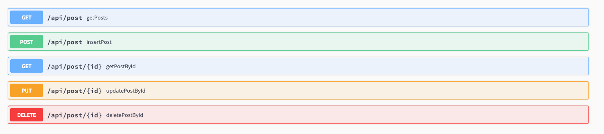

### RESTfull-API

*This is my first intro learning project at SAP Labs Bulgaria*

## Setup

# Requirements
1. Docker

  # Run
  1. Clone the repository
  2. Run `docker-compose up` in the restApi folder from the terminal
  3. Call localhost:8080/api/post
  
  # Operations - Requests

  # Technologies Used
  1. Spring Boot 2.3.3
  2. Maven
  3. PostgreSQL
  4. Docker